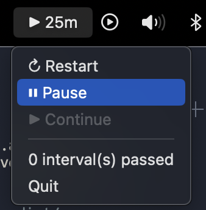

# Pomodoro

Simple statusbar pomodoro timer for macOS



## Build
```bash
pip install --upgrade pip
pip install pipenv
pipenv install
pipenv shell
python setup.py py2app
```

## Usage
`open dist/Pomodoro.app`

Press alt-shift-~ for start timer or click "Restart" in app menu

## Configuration
I didn't want to make settings windows and configs, so I made Settings class with hard-coded options.